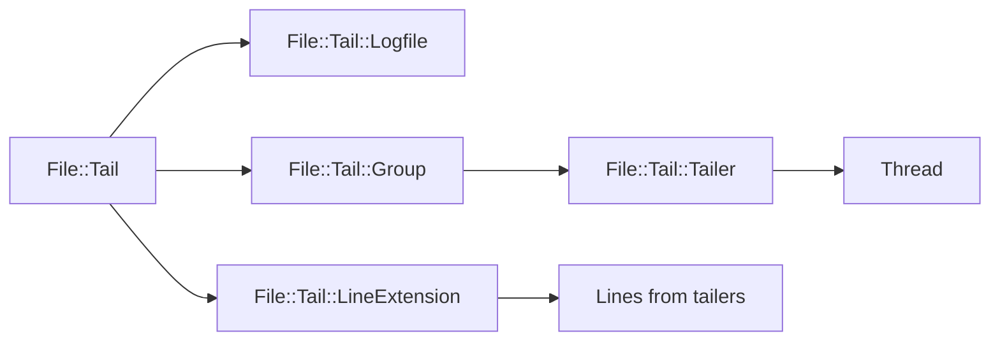
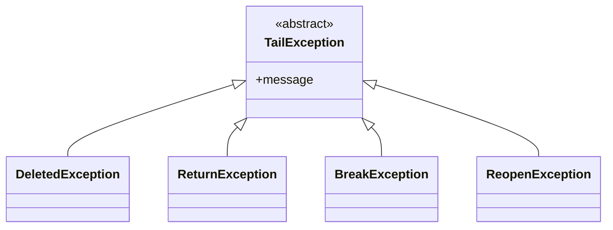

# File::Tail for Ruby

## Description

This is a small ruby library that allows it to "tail" files in Ruby, including
following a file, that still is growing like the unix command 'tail -f' can.

## Documentation

Complete API documentation is available at: [GitHub.io](https://flori.github.io/file-tail/)

## Architecture Overview

File::Tail follows a well-defined architectural pattern with clear
separation of concerns between several key components:

### Core Components

**File::Tail Module**
- The central hub extending File objects with tailing capabilities 🔄
- Provides core methods for forward/backward traversal and tailing 📊
- Handles file system events like rotation, truncation, and deletion 🔁

**File::Tail::Logfile**
- A convenience class that simplifies opening and tailing files with options 🚀
- Includes File::Tail module for direct file access 🧠
- Supports various initialization patterns for flexible usage 🔄

**File::Tail::Group**
- Manages multiple files to be tailed together 🔄
- Uses ThreadGroup to coordinate multiple tailing threads ⏳
- Provides batch operations for concurrent file monitoring 📊

**File::Tail::Tailer**
- A Thread subclass that supervises a single file's tailing 🧠
- Uses queues for line buffering and thread-safe communication 📦
- Implements method_missing for thread-local variable access ⚡

### Component Interactions



The File::Tail module acts as the foundation, providing core functionality that
is extended by Logfile and Group classes. The Group class coordinates multiple
Tailer threads, each managing a single file's tailing process.

### Loading Mechanism

File::Tail supports two primary access patterns:

1. **Direct File Extension** - Extending File objects directly with File::Tail:
   ```ruby
   File.open(filename) do |log|
     log.extend(File::Tail)
     log.backward(10)
     log.tail { |line| puts line }
   end
   ```

2. **Logfile Convenience Class** - Using the Logfile wrapper for simpler usage:
   ```ruby
   File::Tail::Logfile.tail('app.log', :backward => 10) do |line|
     puts line
   end
   ```

## Installation

To install file-tail via its gem type:

```bash
gem install file-tail
```

You can also put this line into your Gemfile:

```ruby
gem 'file-tail'
```

and bundle. This will make the File::Tail module available for extending File objects.

## Usage

File::Tail is a module in the File class. A lightweight class interface for
logfiles can be seen under File::Tail::Logfile.

### Direct Extension of File Objects

```ruby
File.open(filename) do |log|
  log.extend(File::Tail)
  log.interval # 10
  log.backward(10)
  log.tail { |line| puts line }
end
```

It's also possible to mix File::Tail in your own File classes (see also File::Tail::Logfile):

```ruby
class MyFile < File
  include File::Tail
end
log = MyFile.new("myfile")
log.interval # 10
log.backward(10)
log.tail { |line| print line }
```

The forward/backward method returns self, so it's possible to chain methods together like that:

```ruby
log.backward(10).tail { |line| puts line }
```

### Multiple File Tailing with Group

```ruby
group = File::Tail::Group.new
group.add_filename('app.log')
group.add_filename('error.log')
group.tail { |line| puts line }
```

### Advanced Usage with Callbacks

```ruby
log = File::Tail::Logfile.open('app.log')
log.after_reopen { |file| puts "File reopened: #{file.path}" }
log.tail { |line| puts line }
```

### Backward Traversal

```ruby
# Tail last 10 lines of file
File::Tail::Logfile.open('app.log', :backward => 10) do |log|
  log.tail { |line| puts line }
end

# Skip first 5 lines and tail
File::Tail::Logfile.open('app.log', :forward => 5) do |log|
  log.tail { |line| puts line }
end
```

## Documentation

To create the documentation of this module, type

```bash
$ rake doc
```

and the API documentation is generated.

In the examples directory is a small example of tail and
pager program that use this module. You also may want look
at the end of examples/tail.rb for a little example.

## Debugging and Troubleshooting

File::Tail provides built-in debugging capabilities through environment variables:

### Enabling Debug Output

Set the `FILE_TAIL_DEBUG` environment variable to enable detailed debugging information:

```bash
export FILE_TAIL_DEBUG=1
ruby your_tail_script.rb
```

This will output information about:
- File paths being tailed
- Line counts and intervals
- Reopening events
- Sleep intervals and timing

### Exception Handling

File::Tail defines several specific exceptions for different failure scenarios:

```ruby
begin
  log.tail { |line| puts line }
rescue File::Tail::DeletedException
  # Handle file deletion
rescue File::Tail::ReopenException
  # Handle file rotation/reopening
rescue File::Tail::BreakException
  # Handle end-of-file with break_if_eof set
rescue File::Tail::ReturnException
  # Internal exception for controlling tailing behavior
end
```

## Configuration

### Key Attributes

File::Tail provides several configurable attributes for fine-tuning behavior:

```ruby
log = File::Tail::Logfile.open('app.log')
log.interval = 1.0           # Initial sleep interval (default: 10)
log.max_interval = 5.0       # Maximum sleep interval (default: 10)
log.reopen_deleted = true    # Reopen deleted files (default: true)
log.reopen_suspicious = true # Reopen on suspicious events (default: true)
log.suspicious_interval = 60 # Interval before suspicious event detection (default: 60)
log.break_if_eof = false     # Break on EOF (default: false)
log.return_if_eof = false    # Return on EOF (default: false)
```

### Advanced Configuration

```ruby
# Configure for high-traffic logs
log.interval = 0.1
log.max_interval = 1.0
log.suspicious_interval = 30

# Configure for low-traffic logs
log.interval = 5.0
log.max_interval = 30.0
log.suspicious_interval = 120
```

## Performance Considerations

### Thread Safety

File::Tail uses thread-safe mechanisms for concurrent file monitoring:
- ThreadGroup for managing tailer threads
- Mutex and ConditionVariable for synchronization
- Queue-based line buffering for thread communication

### Memory Management

The library implements efficient memory usage:
- Lines are buffered in queues per tailer
- Exponential backoff reduces CPU usage when files are quiet
- Proper thread lifecycle management prevents resource leaks

### File System Event Handling

File::Tail gracefully handles various file system events:
- File rotation (log rotation)
- File truncation
- File deletion
- File reopening after deletion

## Error Handling

File::Tail provides comprehensive error handling for common file system scenarios:

### File::Tail Exception Hierarchy



### Safe Usage Pattern

```ruby
def safe_tail(filename)
  File::Tail::Logfile.open(filename) do |log|
    log.tail { |line| puts line }
  rescue File::Tail::DeletedException
    puts "File was deleted, stopping tailing"
  rescue File::Tail::ReopenException
    puts "File reopened, continuing tailing"
  end
end
```

## Download

The latest version of *File::Tail* (file-tail) can be found at

https://github.com/flori/file-tail

## Author

Florian Frank mailto:flori@ping.de

## License

This software is licensed under the [Apache 2.0 license](LICENSE).
